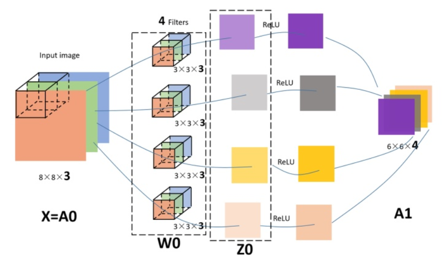
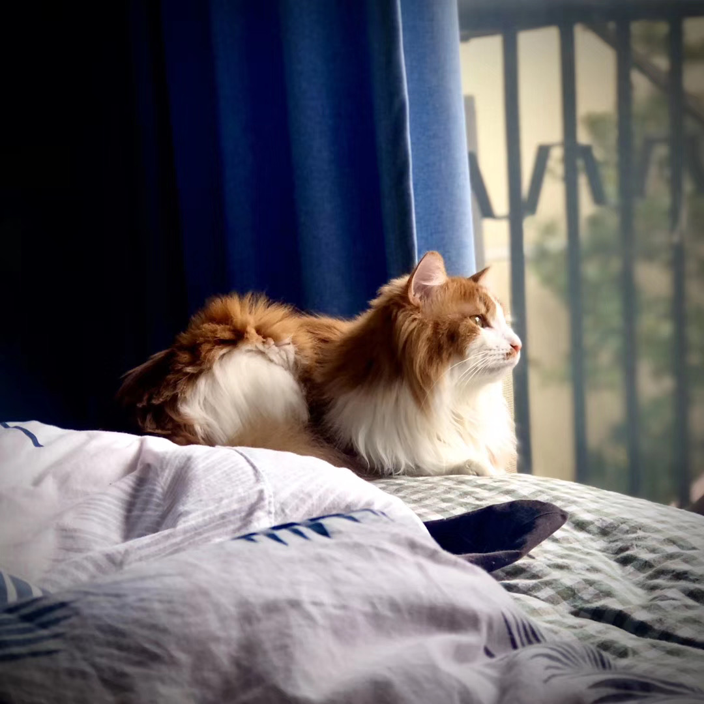

### How have I organized this page?
This page contains details about projects that I have worked on. In order to help readers get the crux of my work with a single look, I have organized each project using a self-designed template:

- The Project Overview
- The Links to the Project
- Reason for the Project’s proximity to my Heart
- Additional Materials (If applicable)

### Animal Image Recognization in Deep Learning

[Animal Image Recognization](https://github.com/zg104/Projects/blob/master/Deep%20Learning/cnn.py) by Zijing Gao.

__The project overview:__ Constructed the TensorFlow framework to establish a multiple hidden-layer CNN model for animal image recognition.

- **Data Preprocessing:** I collected a bunch of animal images, especially for dogs and cats, since they are pretty much the same and hard to distinguish. I always call my cat "年年" pronounced "Nian Nian" in English, and it looks like a cute dog sometimes. This name is created since I want him healthy and well. Most importantly, I want him [年年有余!](https://chinesehacks.com/idioms/abundance-year-after-year/)   I know exactly CNN is greedy, since it needs a ton of data to feed. I almost collected 10,000 more images in all, and I was planing to feed the image of "Nian Nian" as a single test sample into the model to see what would happen!   I utilized ImageDataGenerator based on Keras in Python to rescale and transform the images for processing. 
 
You might want to know how cute he is!

- **Modeling:** As is known, CNN is different from the traditional deep neural networks, where extra processes are applied before we feed the data into neural networks. I created 3 by 3 feature detector matrix for filtering in each convoluntion layer. Then, I conducted paddling, pooling, and fully connected layers to squad and flatten the multidimensional data after several iterations of the previous steps.

- **Evaluation:** My poor laptop suffered from endless torture after several hours' training. I fed 20% of the original data as the test set to the model, and recieved recognization accuracy up to 85% after 25 epochs. That's cool since I have not tuned the parameters yet! The accuracy went up to around 92% after I added more convolution, pooling, and dropout layers, tuned the batch size, the number of epochs, and the optimizer. Finally, I fed 10 images of "Nian Nian" into my model, which gave me 100% accuracy back! Amazing! Sometimes, I should be proud of my photography skills.

- **Follow-on Work:** Actually, dogs and cats still have a lot of differences from head to toe. All of the images I collected are not limited to the facial images, and I would like to further explore the facial recognization of animals, evne emotion analysis of human beings! That is not a big deal for Google, but still challenging for a graduate student like me. I plan to work on millions of facial images based on CNN on the virtual machine to free my laptop. GCP is tasty and I will try my best to degest it.
