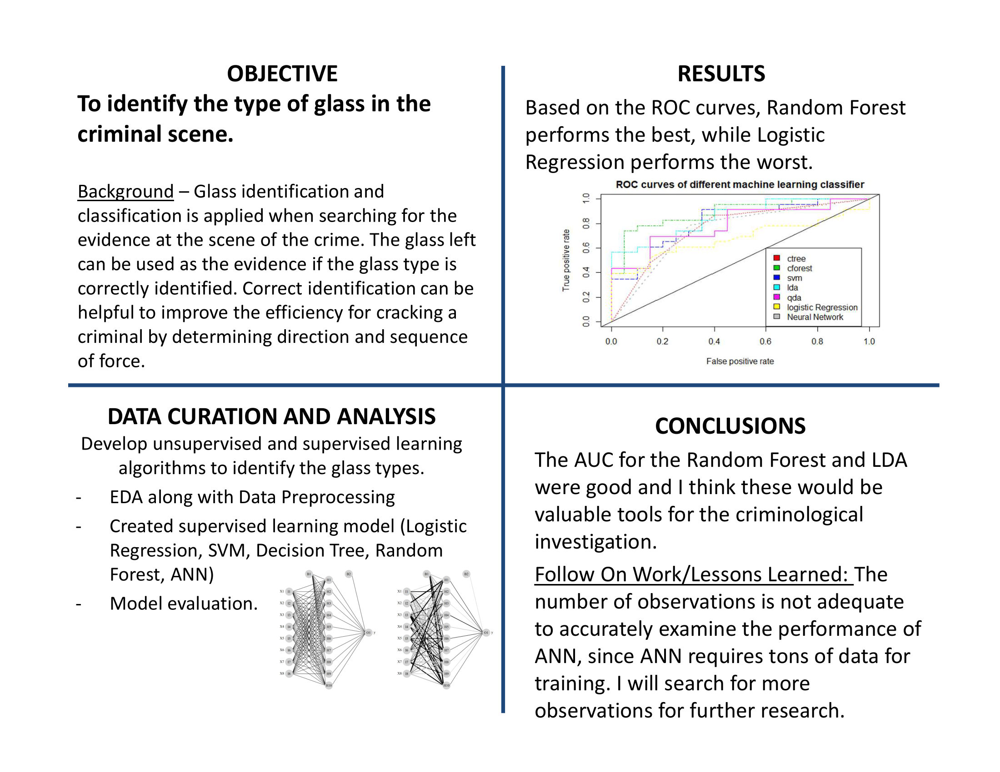

### How have I organized this page?
This page contains details about projects that I have worked on. In order to help readers get the crux of my work with a single look, I have organized each project using a self-designed template:

- The Project Overview
- The Links to the Project
- Heart of the Project
- Coding (If applicable)
- Additional Materials (If applicable)

## Glass Indentification in Criminal Analysis 

[Glass Indentification](https://github.com/zg104/Projects/blob/master/Statistical_learning/Zijing%20Gao%20642-project-final.pdf) by Zijing Gao.

__The project overview:__ Constructed different machine learning methods to identify the glass type in the crime scene to help crack criminals.

### **Data preparation:** 
I extracted the data from UCI, and preprocess it into the suitable version for R analysis. When it comes the data resource, I have to say there won't be too many stupid criminals who will escape through the window and left the broken glass in the crime scene, since the dataset is relatively small. But, it is still cool if correct classfication of glass type can help cracking a criminal, isn't it? If you are interested in it, please [visit!](https://www.crimemuseum.org/crime-library/forensic-investigation/glass-analysis/). 

I prepared and cleaned the data to detect the relationship among all the compositions and properties of glass. It can be unavoidable to conduct EDA and data visualization with Python. No one can imagine how excited I was after spending a lot of effort in preprocessing the data and be prepared to feed it into my model!

### **Modeling:** 
There are many machine learning classification methods, such as logistic regression, Bayesian methods, Support Vector Machine (SVM), ensemble tree models, and neural networks. I am sort of a math guy that is particularly curious of how each model was derived. I assume that each methods has its own "secret" which is waiting for us to explore. 

So, I constructed unsupervised learning models, such as K-means clustering, Hierarchical clustering, and Self-Organized Maps for processing the unlabled data to detect the unknown relationship and reduce the dimensionality. Then, I constructed supervised learning models, such as logistic regression, LDA/QDA, SVM, Random Forest, XGBoost, Bayesian Belief Network, and Aritificial Neural Network to deal with the labeled data for exploring the inner relationship among the features and response. Though it was tough and time-consuming, I have never thought I would really dive into the ocean of ML so deeply. 

### **Evaluation:** 
My priority was to evaluate each model and conduct comparison. As is known, evaluation methods are nothing more than the techniques such as confusion matrix, cross entropy, Gini impurity, ROC/AUC, and so on. Ensemble tree methods, especially XGBoost perform better than other machine learning methods with indentification error: 8.7%, AUC: 95.4%, and cross-entropy: 0.09. 

Evaluating the generalization ability of the model can be critical for developing the model into realistic application. Compared with other classification models horizontally, I found that the optimization of the model's learning rate, total number of decision trees, and training set input has greatly improved the classification accuracy, sensitiity, specificity of the model. I tried to use the random search method to continue tuning the parameters, and I improved the classification accuracy by 7% as I expected. Pretty cool!

### **Follow-on Work:** 
I included several ML methods to fit the data and got a relatively good result though my dataset only contains several hundreds of observations (a little bit fat). I originally assumed that SVM would give the best result since SVM only counted on the support vectors, which were not restricted in the total number of the observations. However, LDA and random forest won. What I will do next is trying to use more boosting methods such as gradient boosting, adaptive boosting to fit instead of using random forest even though it gave me a good result.

Also, the Bayesian analysis (BBN) is not applied to my data. Maybe I will use Bayesian methods to estimate the objective function indirectly and estimate the likelihood using some sampling methods such as MCMC. At last, I have to clarify that ANN is not a good fit for my data. But I will try to search for more observations to expand my dataset and tune the hyperparameters by a grid search to make ANN perform better.

### Coding

Coding part is presented [HERE](https://github.com/zg104/zg104.github.io/blob/master/Documents/project_642.Rmd).
